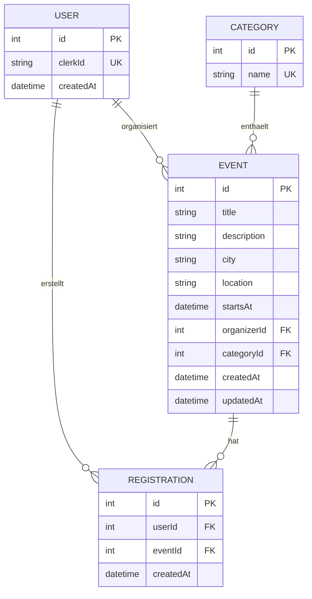

# Entity-Relationship-Diagramm

## Übersicht

EventHub verwendet vier Datenmodelle:

- `User`
- `Category`
- `Event`
- `Registration`

## Diagramm

```mermaid
erDiagram
    USER ||--o{ EVENT : organisiert
    CATEGORY ||--o{ EVENT : enthaelt
    USER ||--o{ REGISTRATION : erstellt
    EVENT ||--o{ REGISTRATION : hat

    USER {
        int id PK
        string clerkId UK
        datetime createdAt
    }

    CATEGORY {
        int id PK
        string name UK
    }

    EVENT {
        int id PK
        string title
        string description
        string city
        string location
        datetime startsAt
        int organizerId FK
        int categoryId FK
        datetime createdAt
        datetime updatedAt
    }

    REGISTRATION {
        int id PK
        int userId FK
        int eventId FK
        datetime createdAt
    }
```
